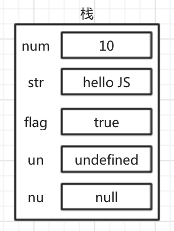
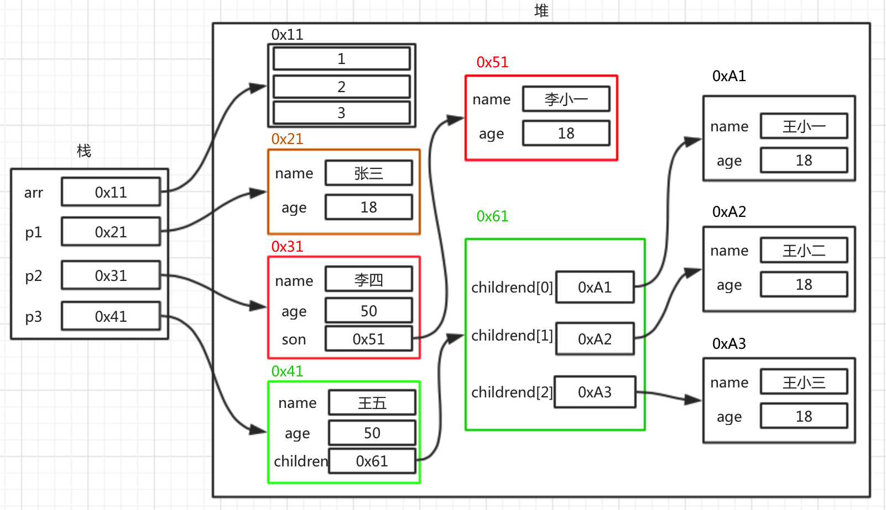

#值类型和引用类型

##1.值类型(基本数据类型)
* `数值类型`
* `布尔类型`
* `undefined`
* `null`
* `字符串`

值类型是存储在栈（stack）中的简单数据，也就是说，它们的值直接存储在变量访问的位置。

```js
var num = 10;
var str = "hello JS";
var flag = true;
var un = undefined;
var nu = null;
```

***上面定义的这些值类型的数据在内存中的存储如下***



##2.引用类型(复合数据类型)
* `对象`
* `数组`
* `函数`

存储在堆（heap）中的对象，也就是说，存储在变量处的值是一个指针（point），指向存储对象的内存处。

```js
var arr = [1, 2, 3];
var p1 = {name:"张三", age:18};
var p2 = {
    name:"李四",
    age:50,
    son:{
        name:"李小一",
        age:18
    }
};

var p3 = {
    name:"王五",
    age:50,
    children:[
        {
            name:"王小一",
            age:20
        },
        {
            name:"王小二",
            age:15
        },
        {
            name:"王小三",
            age:12
        }
    ]
}
```

***上面定义的这些引用类型的数据在内存中的存储如下***




