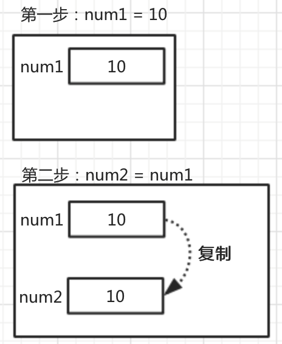

#值类型和引用类型的特征

##1. 值类型和引用类型的赋值

###1.1. 值类型赋值，直接将值复制一份

```js
var num1 = 10;
var num2 = num1;
```

上面两句代码，在内存中的体现为：



* `var num1 = 10;`表示变量num1存储的是数字`10`
* 将数据拷贝一份，也就是将`10`拷贝一份，这个时候内存中有两个`10`
* 将拷贝的`10`赋值给`num2`

###1.2. 引用类型赋值，是将地址复制一份

```js
var p = {name:"张三", age:19};
var p1 = p;
```
上面两句代码，在内存中的体现为：


* `var p = {name:"张三", age:19};`,`p`中存储的是对象的地址
* 赋值就是将变量`p`中存储的数据，也就是地址拷贝一份, 然后将该数据赋值给`p1`
* 此时内存中只有 1 个对象，变量`p`和`p1`同时指向这个对象

**问题: 利用`p1`修改的`name`属性会影响到`p`中的`name`**

##2. 值类型和引用类型做参数

考虑如下情况：输出结果是多少？
```js
function foo(num){
    num++;
}

var a = 1;
foo(a);
console.log(a);

```

继续考虑如下情况：输出结果是多少？

```js
function foo(o){
    o.age++;
}

var p = {name:"张三", age:19};

foo(p);

console.log(p.age);

```

**总结：**

* 在调用函数的时候，传参的过程其实就是用实参给形参赋值的过程

* 当参数为值类型的时候，函数内和函数外的两个变量完全不同，仅仅只是存的值一样而已，修改时互不影响

* 当参数为引用类型的时候，函数内和函数外的两个变量不同，但是共同指向同一个对象，在函数内修改对象数据时会影响外部


扩展：

考虑如下情况：输出结果是多少？

```js

function foo(o){
    o = {name:"张三", age:18};
}

var p;
foo(p);

console.log(p.age);

```


